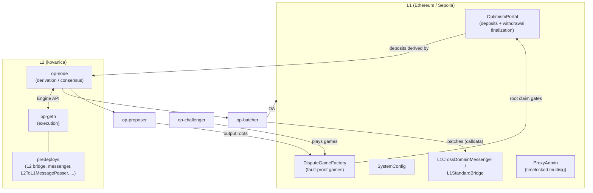

# kovanica-chain architecture

kovanica-chain is an **OP Stack rollup** with **permissionless fault proofs**.
L2 state is deterministically derivable from L1 data, so safety rests on L1 +
the fault-proof system, not on trusting the sequencer. See `CLAUDE.md` for the
full engineering charter.

## Components

| Component | Role | Path |
|---|---|---|
| op-node | Derives L2 blocks deterministically from L1 (batches + deposits); drives op-geth | node stack |
| op-geth | L2 execution client (go-ethereum fork) | node stack |
| op-batcher | Posts compressed L2 data to L1 (DA) | node stack |
| op-proposer | Posts L2 output roots via `DisputeGameFactory` | node stack |
| op-challenger | Plays fault-proof dispute games (Cannon FPVM) | node stack |
| L1 contracts | Portal, DisputeGameFactory, SystemConfig, bridge, ProxyAdmin | `op-contracts/v4.0.0` |
| L2 predeploys | Baked into genesis at fixed addresses | genesis |

## The two safety-critical flows

- **Deposit / forced inclusion (L1→L2):** guaranteed by derivation — see
  [`operations/forced-inclusion.md`](operations/forced-inclusion.md).
- **Withdrawal (L2→L1):** proven against a `DisputeGameFactory` root claim, then
  finalized after the proof-maturity + dispute-game-finality air-gap — see
  [`operations/`](operations/) and [`monitoring/fault-proofs.md`](monitoring/fault-proofs.md).

## Config that must stay in lockstep

`devnet/network_params.yaml`, `packages/contracts-bedrock/deploy-config/*.json`,
`versions.json`, and (once generated) `genesis.json`/`rollup.json` +
the Cannon absolute prestate. CI enforces the cross-file agreement
(`scripts/check-*.py`); the prestate must be regenerated whenever chain config
or the contracts tag changes (`scripts/gen-prestate.sh`).

## Stages

local Kurtosis devnet → Sepolia testnet → mainnet. Current stage: **local
devnet**, Sepolia scaffolded (NO-GO until roles/prestate filled and audited).
See [`bootstrapping-fault-proof-op-stack-2026.md`](bootstrapping-fault-proof-op-stack-2026.md).
